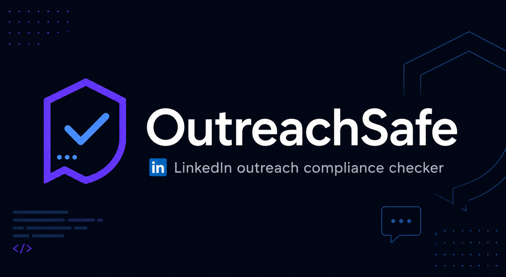

  

  
  
  
  
  

---

**Compliance checking for sales outreach — before you hit send.**

---

OutreachSafe checks your LinkedIn messages and email outreach against GDPR, CAN-SPAM, and LinkedIn Terms of Service in real time. It flags violations before you send, so your sales team stays compliant without slowing down. Built for SDRs, sales ops, and revenue teams at regulated companies.

---

## ⚡ Live Demo

**[Try it free at outreachsafe.com](https://www.outreachsafe.com)** — no account required.

---

## 🔍 What It Checks

| Framework | What it covers | Who it affects |
|---|---|---|
| GDPR | Consent, data handling, EU recipient rules | Any team emailing EU contacts |
| CAN-SPAM | Unsubscribe, sender ID, subject line rules | US email outreach |
| LinkedIn ToS | Platform-specific messaging rules | LinkedIn Sales Nav users |
| Tone & Spam signals | Aggressive language, spam triggers | All outreach |

---

## 🚀 How It Works

1. Install the Chrome extension or open the web app
2. Paste your message or write directly in LinkedIn
3. Get instant compliance feedback before you hit send

---

## 💻 Chrome Extension

**[Chrome Web Store — Coming Soon](#)**

Works directly inside LinkedIn — no copy/paste required.

---

## 💰 Pricing

| Plan | Price | What's included |
|---|---|---|
| Free | $0 | 25 scans/month, basic compliance check |
| Pro | $19/month | Unlimited scans, full compliance report, history |
| Team | $49/seat/month | Everything + team dashboard, manager view, bulk scanning |

Annual billing available — 2 months free.

👉 [View full pricing at outreachsafe.com/pricing](https://www.outreachsafe.com/pricing)

---

## 🏢 Part of the CGT Compliance Platform

OutreachSafe is one of three compliance products built by Cyber Global Technologies.

| Product | Layer | What it does |
|---|---|---|
| **OutreachSafe** | Sales | Compliance for outreach messages |
| **MergeMind** | Engineering | Compliance-aware PR analysis |
| **Compliance AI** | GRC | Enterprise audit and risk platform |

---

## 🔒 Security & Privacy

- We do not store your message content
- All analysis runs in real time — nothing is logged
- GDPR compliant by design

👉 [Privacy Policy](https://www.outreachsafe.com/privacy)

---

## 🌐 Connect

- **Website:** [outreachsafe.com](https://www.outreachsafe.com)
- **LinkedIn:** [linkedin.com/company/cyber-global-technologies](#) *(update link)*
- **Built by:** Fretz Olivares — [Cyber Global Technologies](https://www.cyberglobal.ai)
- **Enterprise inquiries:** [outreachsafe.com/contact](https://www.outreachsafe.com/contact)

---

  © 2026 Cyber Global Technologies LLC. All rights reserved. 
  Released under the <a href="LICENSE">MIT License</a>.

